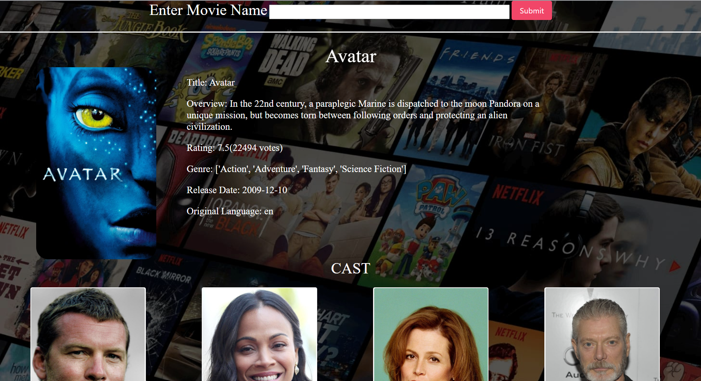

## **Movie Recommender**

Movie Recommendation Engine built on Django based on Collaborative Filtering
Content Based Recommender System recommends movies similar to the movie user likes and analyses the sentiments on the reviews given by the user for that movie.

The details of the movies(title, genre, runtime, rating, poster, etc) are fetched using
an API by TMDB, https://www.themoviedb.org/documentation/api, and using the 
IMDB id of the movie in the API.

Screenshots:

